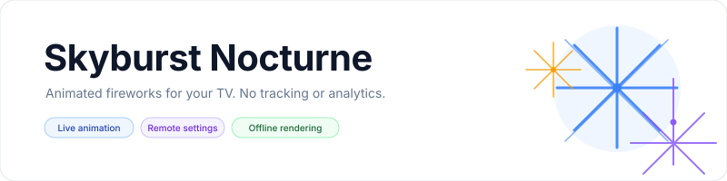
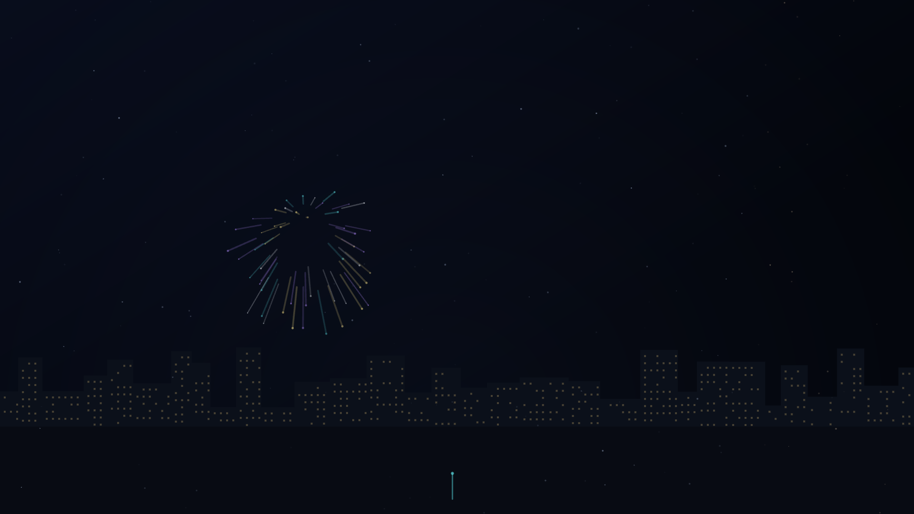
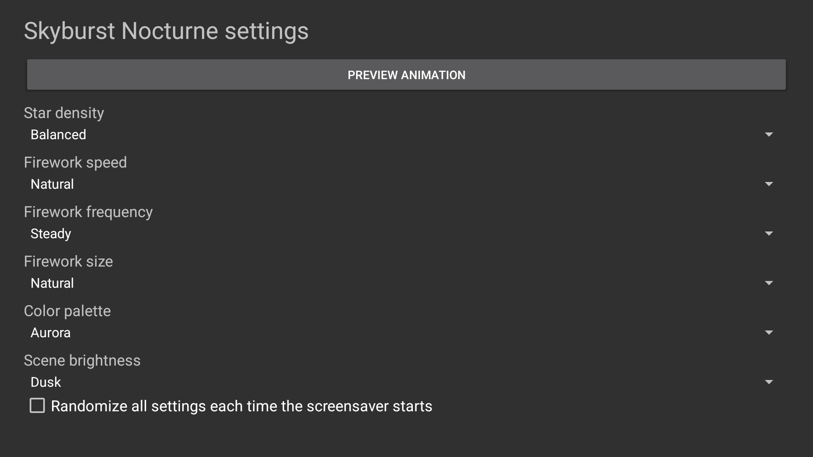

<p align="center">
    <picture>
        <source media="(prefers-color-scheme: dark)" srcset="art/banner-dark.svg">
        <source media="(prefers-color-scheme: light)" srcset="art/banner-light.svg">
        
    </picture>
</p>

<p align="center">A continuously animated fireworks screensaver for Fire TV, Android TV, and Google TV.</p>

<p align="center">
    <a href="https://github.com/jeremykenedy/skyburst-nocturne/releases"></a>
    <a href="https://github.com/jeremykenedy/skyburst-nocturne/releases"></a>
    <a href="LICENSE"></a>
    <a href="https://github.com/jeremykenedy"></a>
    <a href="https://github.com/jeremykenedy/skyburst-nocturne" title="Open the repository and click Star"></a>
    <a href="https://github.com/sponsors/jeremykenedy"></a>
</p>

Show some love by starring this repository on GitHub.

## Table of contents

- [Privacy](#privacy)
- [Features](#features)
- [Requirements](#requirements)
- [Installation](#installation)
- [Configuration](#configuration)
- [Screenshots](#screenshots)
- [Fire TV Toolkit](#fire-tv-toolkit)
- [Building and testing](#building-and-testing)
- [Documentation](#documentation)
- [Release notes](#release-notes)
- [License](#license)

## Privacy

The app requests no network permission and makes no network requests. It contains no ads, analytics, telemetry, crash reporting, tracking, or reporting code. Settings remain on the device. The optional installer contacts GitHub only when you ask it to download a release and checksum; those requests contain no TV or usage data.

## Features

- Continuously animated firework trails over a layered deep-space starfield.
- Quiet, steady, and festival launch rates, with fine, natural, and grand burst sizes.
- Sparse through packed star density, three palettes, three speed settings, and night, dusk, or bright scenes.
- Per-setting Random selections and an optional Randomize All setting for each new session.
- Remote-friendly settings, live preview, and a validated settings provider for host apps.
- Android DreamService pauses its drawing loop when the dream stops.
- Original procedural rendering with no bundled videos, third-party images, or runtime dependencies.

## Requirements

- Android 6.0 (API 23) or newer with DreamService support.
- Android SDK platform 36 and build-tools 36.0.0 to build from source.
- ADB for computer-based installation.

Emulator verification and physical device limitations are recorded in [device verification](docs/VERIFICATION.md). Fire TV, Android TV, and Google TV device coverage remains subject to the exact hardware and firmware tested.

## Installation

Connect the device to the same network as your computer, enable ADB debugging, then run:

```bash
python3 install.py --serial TV_IP:5555
```

The installer downloads the latest signed release from this repository, checks its SHA-256 file, and installs or updates the app. Select **Skyburst Nocturne** in the device's screensaver or ambient display settings. To remove it, run `python3 install.py --serial TV_IP:5555 --uninstall` and confirm the prompt. Local APK and unattended install instructions are in [installation and removal](docs/INSTALLATION.md).

## Configuration

Open **Skyburst Nocturne** from the device launcher. The settings apply when the next preview or screensaver session starts.

| Setting | Options | Default |
| --- | --- | --- |
| Firework frequency | Quiet, Steady, Festival, Random | Steady |
| Firework size | Fine, Natural, Grand, Random | Natural |
| Firework speed | Slow, Natural, Fast, Random | Natural |
| Star density | Sparse, Balanced, Dense, Packed, Random | Balanced |
| Color palette | Aurora, Ember, Tropical, Random | Aurora |
| Scene brightness | Night, Dusk, Bright, Random | Dusk |
| Randomize all settings | Off, On | Off |

Each random option selects a supported value for that setting at the start of a session. The global option chooses all six values at each start. See [configuration and the settings provider](docs/CONFIGURATION.md) for details.

## Screenshots

<p align="center">
    
</p>
<p align="center">
    
</p>

Both screenshots were captured from the running app on a Google TV emulator. The scene capture comes from the app preview, which uses the same renderer as the screensaver service. Device details and limitations are recorded in [verification](docs/VERIFICATION.md).

## Fire TV Toolkit

[Fire TV Toolkit](https://github.com/jeremykenedy/fire-tv-toolkit) provides guided screensaver installation, updates, activation, sleep and screensaver timers, and supported settings protection. Clone and set it up on your computer:

```bash
git clone https://github.com/jeremykenedy/fire-tv-toolkit.git
cd fire-tv-toolkit
node setup.js
```

Once Skyburst Nocturne is in Toolkit's reviewed catalog, install it and select it with:

```bash
firetv-screensavers --install=skyburst-nocturne --yes
screensaver --set=skyburst-nocturne
```

Use the same install command to update the signed package while keeping its saved settings. Remove it with:

```bash
firetv-screensavers --uninstall=skyburst-nocturne --yes --force
```

Toolkit manages device timers and its supported settings protections. Skyburst Nocturne keeps its visual options locally. The screensaver must be added to Toolkit's reviewed catalog before these commands are available.

## Building and testing

```bash
bash build.sh
bash test.sh
```

The build signs a local APK with a project-specific key stored outside the repository under `~/.android/`. Keep the key and its password backed up for future signed upgrades. See [building](docs/BUILDING.md), [testing](docs/TESTING.md), and [architecture](docs/ARCHITECTURE.md).

## Documentation

- [Installation and removal](docs/INSTALLATION.md)
- [Configuration and host settings](docs/CONFIGURATION.md)
- [Building from source](docs/BUILDING.md)
- [Architecture](docs/ARCHITECTURE.md)
- [Testing](docs/TESTING.md)
- [Device verification](docs/VERIFICATION.md)
- [Troubleshooting](docs/TROUBLESHOOTING.md)
- [Release process](docs/RELEASING.md)

## Release notes

- [Version 1.0.0](docs/releases/v1.0.0.md)
- [Changelog](CHANGELOG.md)

## License

Skyburst Nocturne is licensed under the [Apache License, Version 2.0](LICENSE). See [NOTICE](NOTICE) for project notices.
